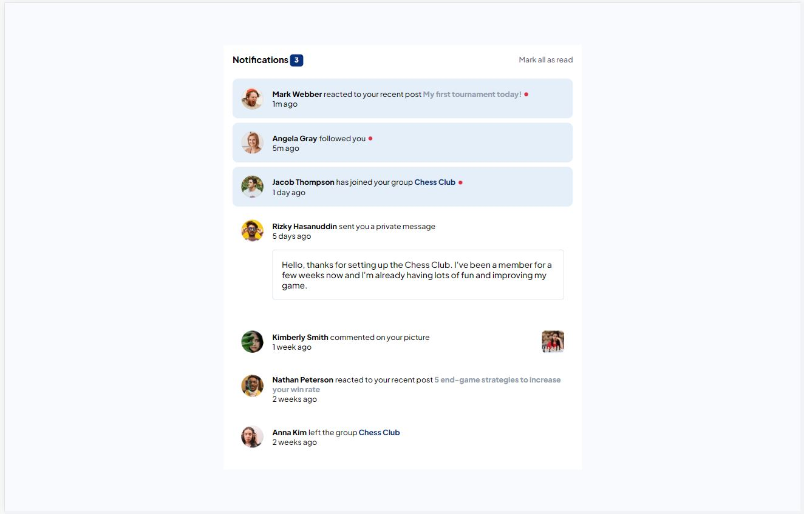

# Frontend Mentor - Notifications page solution

This is a solution to the [Notifications page challenge on Frontend Mentor](https://www.frontendmentor.io/challenges/notifications-page-DqK5QAmKbC). Frontend Mentor challenges help you improve your coding skills by building realistic projects. 

## Table of contents

- [Overview](#overview)
  - [The challenge](#the-challenge)
  - [Screenshot](#screenshot)
  - [Links](#links)
- [My process](#my-process)
  - [Built with](#built-with)
  - [What I learned](#what-i-learned)
  - [Continued development](#continued-development)
- [Author](#author)
- [Acknowledgments](#acknowledgments)

## Overview

### The challenge

Users should be able to:

- Distinguish between "unread" and "read" notifications
- Select "Mark all as read" to toggle the visual state of the unread notifications and set the number of unread messages to zero
- View the optimal layout for the interface depending on their device's screen size
- See hover and focus states for all interactive elements on the page

### Screenshot

### Links

- Solution URL: [Github solution repo](https://github.com/aljager1983/notifications-page)
- Live Site URL: [Frontend Mentor | Notifications page](https://aljager1983.github.io/notifications-page/)

## My process

### Built with

- Semantic HTML5 markup
- Flexbox
- CSS Grid
- Mobile-first workflow

### What I learned

On this project, I familiarized myself with the use of multiple inline elements and how to use css on them with different styles.

### Continued development

Going to keep studying javascript and DOM manipulations. 

**Note: Delete this note and replace the list above with resources that helped you during the challenge. These could come in handy for anyone viewing your solution or for yourself when you look back on this project in the future.**

## Author

- Frontend Mentor - [@aldrinbfernandez](https://www.frontendmentor.io/profile/aldrinbfernandez)
- Twitter - [@promdiGamer](https://twitter.com/promdiGamer)

## Acknowledgments

The courses I have undergone in Udemy with Dr. Angela is helping me a lot. Had couple of notes during that bootcamp and I'm now they are helping a lot since I can't remember most of the syntaxes.